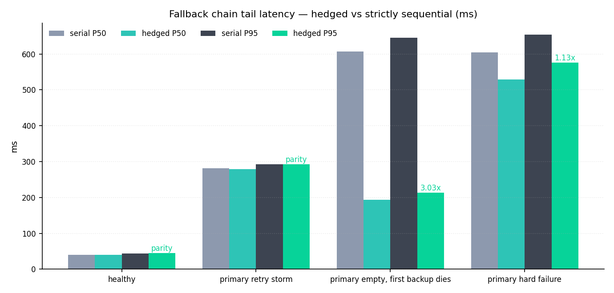
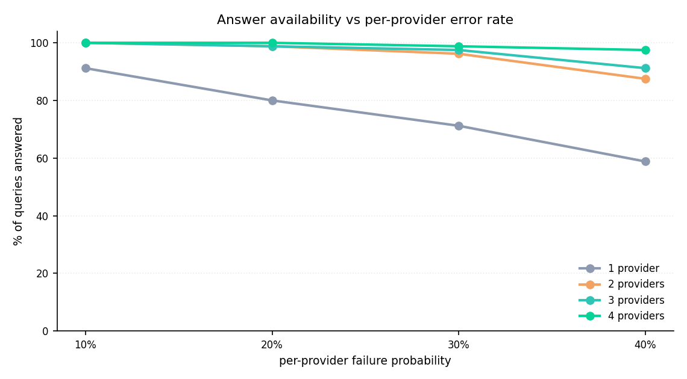
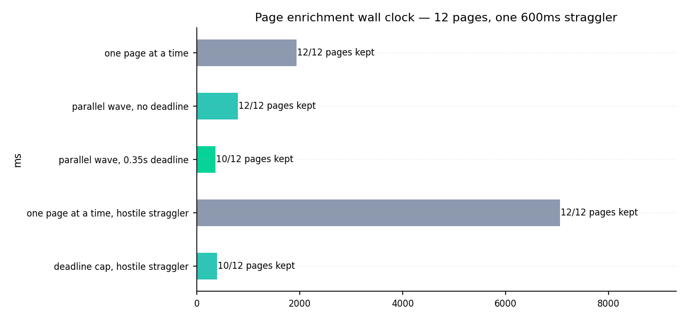

<div align="center">

# FinKeySearch

**The web-search layer for AI agents that answers *before* the model does.**
Hedged multi-provider fallback, an LLM-first "do I even need to search" gate,
deadline-bounded parallel page enrichment, an evidence critic that rewrites the
query when the first pass is thin, and a deep-research fan-out — with
**zero required dependencies**.

`pip install finkey-search`


</div>

---

## The problem

"Give the LLM a search tool and a prompt" breaks in production three ways:

1. **Latency cliffs.** One provider rate-limits or hangs and the whole turn stalls.
2. **Snippet-only answers.** SERP snippets are headlines; the model confidently
   quotes a number that lived one click deeper, on a page you never fetched.
3. **Over-searching & under-searching.** Regex "when to search" lists fire on
   "hi" and miss "why did it crash today".

FinKeySearch is the retrieval layer we run inside the FinKey platform, extracted
standalone. It decides *whether* to search, races providers so a slow one can't
win, reads the actual pages under a hard wall-clock budget, and critiques its own
evidence before handing it to the model.

## What makes it different

- **Hedged fallback chain.** Serper starts immediately; if it hasn't answered
  within a grace window, Brave/Bing/Tavily launch **in parallel** and the best
  non-empty result wins. Serial degradation ("6 s + 3 s + …") becomes one race
  at ~max(), not sum(). `FINKEY_SEARCH_HEDGE_MS` tunes it; set `0` for strict serial.
  Measured: **3.03x better P95** when a layer degrades, parity when nothing is wrong.
- **Per-provider circuit breakers + sliding-window rate limits.** A provider
  throwing 429s is skipped until it recovers — you never pay for a dead backend.
- **LLM-first classifier, not regex.** `llm_primary`/`llm_only` modes make a tiny
  model decide search-need, category and depth (FAST/DEEP); only trivial chat
  ("hi", "thanks", `2+2`) is short-circuited heuristically. No brittle keyword lists.
- **Deadline-bounded parallel enrichment.** Top hits are fetched concurrently
  under a global wall-clock budget (fast ≈ 3.5 s, deep ≈ 8 s); stragglers are
  abandoned, whoever answered in time is kept. `answer_ready` early-stop wins
  mid-wave. A hung host cannot burn the whole turn. Measured: **17.8x** faster than a
  sequential loop when one host takes 3 s, at 10/12 pages kept.
- **Evidence gate + gap planner.** After retrieval a critic asks "what's missing?"
  and, if the evidence is thin, fans out 3–5 new targeted queries — then merges
  with provenance.
- **Deep-research orchestrator.** A coordinator splits a hard question into
  parallel sub-agents (generic research lenses, not topic allowlists), runs them,
  and dedupes results for the answer model.
- **Graceful by construction.** No keys → the chain is empty and nothing crashes.
  No `requests`/`scrapling`/`redis` → those optional paths are skipped. No
  Playwright browser backend → enrichment falls back to HTTP. Every missing
  dependency disables exactly one feature.
- **Grounding & citation helpers.** snippet sanitization, numeric critic,
  claim/citation verification and a GitHub-repo fact fetcher ship in the box.

## Measured, not promised

`bench/search_bench.py` runs the real chain, the real breaker, the real limiter and
the real enrichment scheduler against synthetic backends with controlled latencies.
No network, no API keys, seeded jitter, 24 trials per cell. Production latencies are
scaled by 0.1 (a 2000 ms hedge is 200 ms here), so the finding is the ratio.

```bash
PYTHONPATH=src python3 bench/search_bench.py   # rewrites bench/RESULTS.md + figures/
```

### Hedged fallback vs strictly sequential (P95)



| scenario | serial | hedged | ratio |
|---|---|---|---|
| everything healthy | 44 ms | 45 ms | 0.96x |
| preferred provider answers slowly after retries | 293 ms | 293 ms | 1.00x |
| preferred returns empty, first backup dies | 645 ms | 213 ms | **3.03x** |
| preferred provider hard-fails at 500 ms | 654 ms | 576 ms | 1.13x |

The chain never trades the preferred provider's answer for a faster one from a backup,
so a *slow but successful* provider stays parity by design. The win is the sum: as soon
as one layer degrades or errors, the next layer was already in flight, and P95 drops 3x.
Hedging costs about 4% when nothing is wrong (thread launch) and pays it back the moment
something is.

### Availability vs per-provider failure rate



| per-provider error rate | 1 provider | 2 | 3 | 4 |
|---|---|---|---|---|
| 10% | 91% | 100% | 100% | 100% |
| 20% | 80% | 99% | 99% | 100% |
| 30% | 71% | 96% | 98% | 99% |
| 40% | 59% | 88% | 91% | **98%** |

1280 queries, sequential chain, measured against the analytical `1 - p^k`. A single
provider that fails 40% of the time loses 4 answers in 10. Four providers lose 2 in 100.

### Deadline-bounded page enrichment (12 pages, one hostile host)



| configuration | wall clock | pages kept |
|---|---|---|
| one page at a time | 1942 ms | 12/12 |
| parallel wave, no deadline | 805 ms | 12/12 |
| parallel wave, 350 ms deadline | 371 ms | 10/12 |
| one page at a time, 3 s anti-bot host | 7053 ms | 12/12 |
| deadline cap, 3 s anti-bot host | **396 ms** | 10/12 |

Concurrency alone is 2.4x. The deadline is what protects the turn: a single hostile host
costs 7 s in a naive loop and 0.4 s here, and the two pages that were abandoned are the
slowest ones, not the most relevant.

### Correctness contracts

8/8 pass in the same run (`bench/RESULTS.md`): the breaker opens after its threshold,
half-opens after the window and closes on a success; the limiter admits exactly the quota
and its window slides; `hedge=0` never overlaps backends; hedging does overlap a slow
preferred provider; and the preferred provider's answer is the one that wins.

## Quickstart

```bash
pip install "finkey-search[http]"
export SERPER_API_KEY=...        # optional: add BRAVE_API_KEY / BING / TAVILY to hedge
```

```python
from finkey_search import WebSearchEngine

engine = WebSearchEngine()
ctx = engine.run(
    message="What is the current USD/EUR rate?",
    generate_fn=my_llm_callable,   # used by the classifier + synthesis
    conversation_key="sess-1",
)
if ctx.found:
    print(ctx.synthesized)         # dated knowledge block for the system prompt
    print(ctx.citation_urls)
```

With no keys at all the call still returns cleanly (`ctx.found == False`) — the
engine never raises because a provider is missing.

## Architecture

```
 message
   │
   ├─ SearchNeedClassifier (LLM-first) ── skip? ─▶ (no web)
   │        FAST | DEEP, category
   ├─ FallbackSearchChain ── Serper ∥(hedge)∥ Brave ∥ Bing ∥ Tavily
   │        per-provider: rate-limiter + circuit-breaker
   ├─ SearchReranker (heuristic + optional LLM trim)
   ├─ page_enrichment ── parallel fetch under one wall-clock deadline
   │        Playwright (optional) → Scrapling → plain HTTPS
   ├─ evidence_gate ── critic: enough? if not → gap-planner → 2nd SERP wave
   ├─ research_orchestrator (DEEP) ── coordinator → parallel sub-agents → merge
   └─ ResultSynthesizer ─▶ dated "LIVE WEB DATA" block + citation urls
```

## Native tool schema

Ships an OpenAI-format `web_search` tool (`tools_schema.py`) with `depth`
(fast/deep), `subqueries`, `urls` (allowlist for a second deep pass) and
`mode=verify` (fact-check a draft answer against prior evidence) — drop it
straight into a tool-calling loop.

## Tests

```bash
pip install -e ".[test]"
pytest -q          # 95 tests + 12 subtests, ~3s, no network, no keys
```

| area | cases | what is pinned |
|---|---|---|
| chain, resilience, policy, engine | 38 | hedged vs serial order with fake backends, breaker, sliding-window quota, Serper backoff, Bing/CSE parsing on fixtures, retry budgets, Prometheus export, conversation search budget, wave early-stop, URL policy and SSRF |
| evidence quality | 24 | claim verification against retrieved numbers, citation must name an allowed source, answer-shape quality (loops, truncation, structure) |
| source selection | 15 | URL quality scoring: junk, aggregators, paywall and freshness signals |
| query understanding | 18 | search-need classifier schema, compact SERP query rewriting, portal routing, visual-media intent, tool-schema arguments |

Everything runs offline: providers are faked, page fetchers are faked, and the fixtures
are captured SERP payloads. `pytest -q` on a laptop with no keys is the gate.

## Where the code lives

| module | LOC | responsibility |
|---|---|---|
| `engine.py` | 2187 | the turn pipeline: classify, search, rerank, enrich, gate, synthesize, budget |
| `backends/` | 1298 | Serper / Brave / Bing / Google-CSE / Tavily adapters + the hedged chain |
| `classifier.py`, `live_query.py`, `trivial_skip_lexicon.py` | 1857 | search-need decision, category, depth, SERP query rewriting |
| `evidence_gate.py`, `claim_verify.py`, `numeric_critic.py`, `answer_quality.py`, `citation_verify.py` | 1527 | the critic layer: is the evidence enough, are the numbers real, is the shape sound |
| `research_orchestrator.py` | 764 | DEEP fan-out: coordinator, sub-agent plans, provenance merge |
| `page_enrichment.py` | 670 | deadline-bounded parallel page reading, early stop, HTTP degrade |
| `url_policy.py`, `url_quality.py`, `http_text_fetch.py`, `scrapling_fetch.py` | 879 | SSRF-safe fetching and source selection |
| `resilience.py`, `redis_cache.py`, `metrics.py`, `telemetry.py` | 559 | breakers, rate limits, cache, counters, OTel hooks |
| `tools_schema.py` | 295 | OpenAI-format `web_search` tool for a tool-calling loop |

## Why there is no provider bake-off

A "Serper vs Tavily vs Bing" table would compare billing plans, index coverage and rate
limits on a given day, not code. This layer is deliberately provider-agnostic: it is
measured above on the machinery it actually owns (chain scheduling, failure handling,
enrichment budgeting), with synthetic backends so the numbers are reproducible on your
laptop without a single API key. Add whichever providers you have a contract with.

## What this is / isn't

This is the **search + retrieval** layer. The headless **browsing operator**
(stealth, fingerprint, multi-step page interaction) is a separate, non-included
FinKey component; `WebSearchEngine` detects its absence and runs search-only.
It is **not** a document-RAG index — pair it with a retriever of your choice.

## Contributing

PRs welcome — see [CONTRIBUTING.md](CONTRIBUTING.md). Contributions assign
copyright to FinKey (keeps the community edition AGPL *and* lets us fund it).

## License

AGPL-3.0-only. Use it, fork it, serve it — but if you modify it and offer it over
a network, your changes go back to the community. Part of the FinKey agent
platform family — see also
[FinKeyMemory](https://github.com/NikitaKoreshkov/FinKeyMemory) and
[FinKeyEvals](https://github.com/NikitaKoreshkov/FinKeyEvals).
